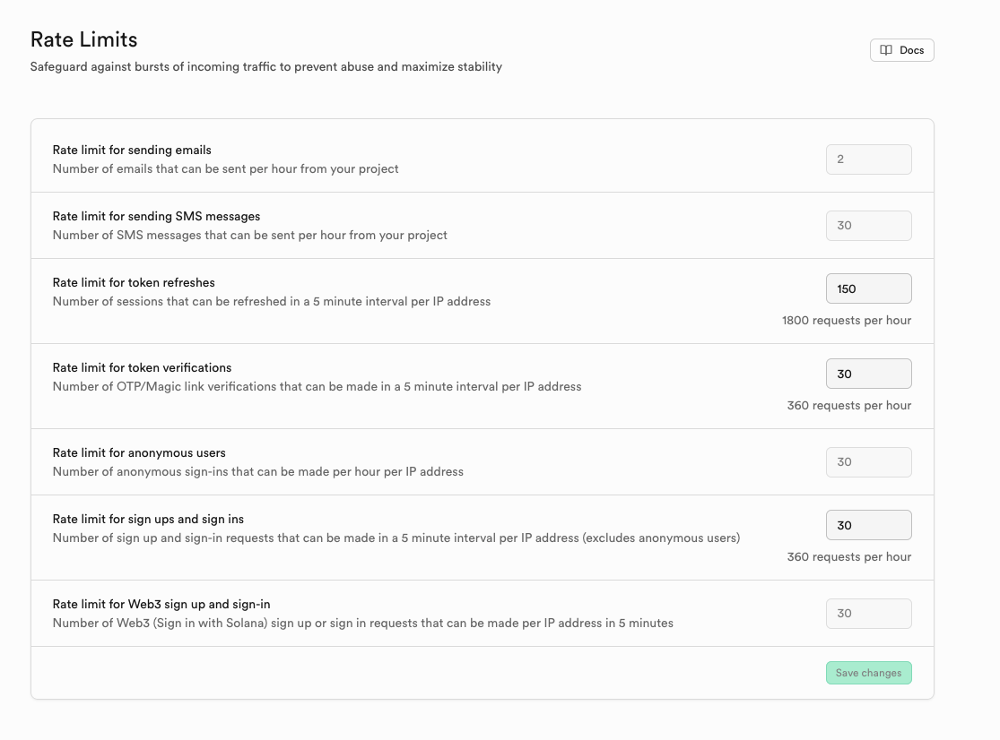
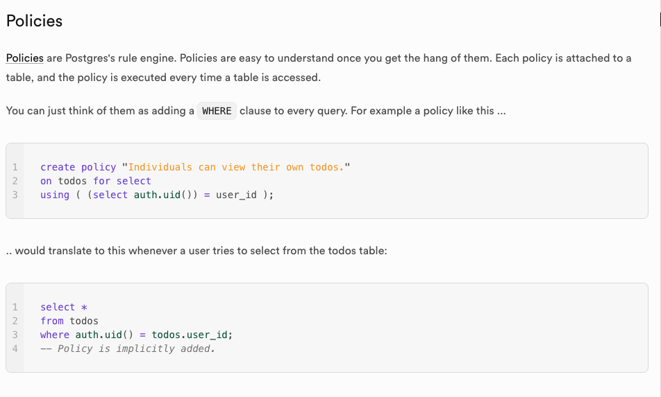
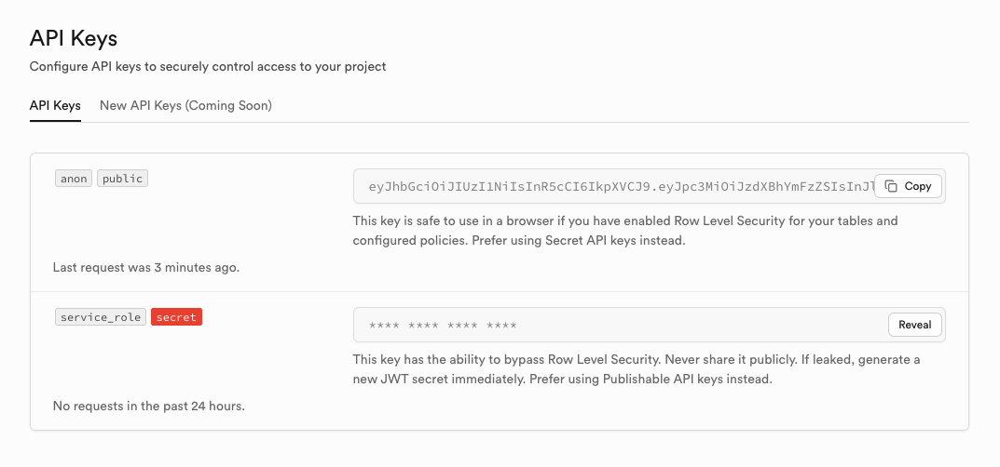
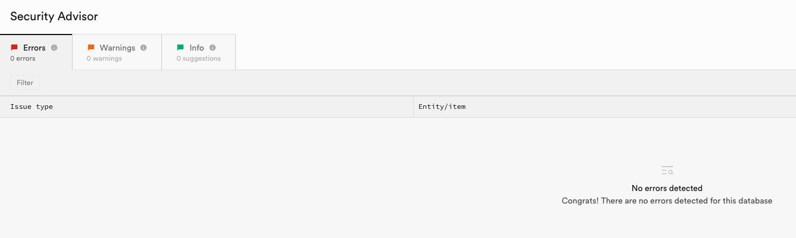

## TLDR

- Supabase is an open-source Firebase alternative built on Postgres with a RESTful API layer.
- It’s easy to set up but has configuration depth that can introduce serious security issues.
- Key areas to test: authentication quirks, row level security (RLS), and exposed frontend logic.
- Supabase’s Security Advisor tool can help validate findings.

## What is Supabase?


If you've been anywhere near technology since the advent of large language models, you have likely heard Supabase mentioned. Often, this is currently marred with the brush of "Vibe Coding", which rightfully has some critics. However, I would argue that Supabase's popularity in this space comes from its ease to set up and get going, and its scalability if your app is successful. Add in that Supabase is open source so should be here for the future, and I think it is quite a good choice to back your application for most people. In this article, we will be focusing on the hosted version of Supabase at https://supabase.com, not on the self-hosted offering.

Supabase is billed as an open source competitor to Google's offering Firebase. It provides a complete backend stack for developers, leveraging PostgreSQL as the database and PostgREST middleware for API queries. It includes built-in authentication, authorisation, and logging.

### What the hell is PostgREST?


You heard right, Supabase uses a piece of technology called [PostgREST](https://postgrest.org/), a portmanteau of Postgres and REST. PostgREST builds a fully RESTful API from an existing PostgreSQL database without any configuration needed. Each DB table becomes an API endpoint which can be refined with query parameters. It is an elegant solution when tied with Row Level Security (RLS), which allows the developer to specify which users can access/modify which pieces of data — essentially acting as authorisation.

## Testing a Supabase Application

Now we know what Supabase is — how can we break it to our advantage? Over the last 6 months, I have tested multiple Supabase apps for customers as a penetration tester and contributed multiple issues to the Supabase vulnerability disclosure program. 

Through this, I have gained some knowledge which I feel applies to most applications built on Supabase, which I will try to distill below. I have tried to write this as a primer and keep the tips basic but useful. This will in no way be comprehensive, but I hope it will allow you to start testing with confidence and avoid the overwhelm of a new tech stack.

### Authentication

Supabase provides a solid authentication base. Email/password authentication works and is secure with the flick of a switch. OAuth requires some config but has sensible defaults that make common pitfalls hard to fall down.

This does not mean it is simple. As always, there is enough rope for a developer to hang themselves with in the config. Everything from JWT signing keys to rate limits are configurable in the UI. It is worth creating a free account on Supabase and going through these options to understand what a developer could have changed and may be vulnerable.




One common issue I've run into with Supabase is MFA. In my opinion, it is not as deeply integrated with the platform as the rest of the authentication options. Although it is a toggle to turn on, it has to be manually applied to each endpoint using row level security. In my experience, this has led to MFA bypasses and just broken MFA functionality in general. I would advise testing this extensively.

Supabase’s handling of password resets and email verification has some quirks worth understanding. Unusually, Supabase allows you to bypass authentication with a forgot password link. They act essentially like magic links which act as one-time login links bypassing traditional auth. From here, a developer must create a frontend which hits an endpoint to change the password. This can also be used instead of email verification when creating an account. Although this is unusual and feels like it could be wrong, I have not yet found an instance where this causes any security issues.

A final quirk on forgot password is that the old password is not required in the normal Supabase flow. This leads to a potential issue: if an attacker could gain access to a valid bearer token, they can change the user's password to create persistence and possibly block the user from accessing their account.

### Authorisation

If we're talking about authorisation, we are mostly talking about [row level security (RLS)](https://supabase.com/docs/guides/database/postgres/row-level-security). It has already been mentioned, but in this section, we will go into it in detail. RLS is the single most important part of Supabase when it comes to information security. If RLS is off, every authenticated (or even unauthenticated) user can read or write to _any_ table in your database, a catastrophic failure point. Supabase will strongly warn users when they have it switched off, so I have not often seen it off entirely. However, due to its potential complexity, I have seen it implemented with holes in.



Test every endpoint that can be found and try to retrieve all information. Ensure that excessive data exposure or Indirect Direct Object References (IDOR) are not possible. You can find the different ways to query the PostgREST API in the [documentation](https://docs.postgrest.org/en/v13/references/api/tables_views.html#operators). An interesting trick to return all accounts when a table is being queried with UUIDs is to use the greater than (`gt`) or less than (`lt`) operator. Although a UUID is not commonly seen as numerical, it is possible to use `gt` and a UUID with all 0's and it will show all UUIDs it can access.

```
id=gt.00000000-0000-0000-0000-000000000000
```

A final thing to understand about authorisation on Supabase is the difference between an anon and service key (Soon to be refined for clarity by Supabase). Both are in the JWT format. An anon key is public and will be sent with every request whether you are authenticated or not. A service key on the other hand allows a user to bypass all RLS policies and gain full read/write access to the database.. Therefore this key is considered incredibly secret and if found allows full access to the database.



### Testing the frontend

The frontend is entirely disconnected from Supabase and should be threat modelled separately. That said, I have found that a lot of people that use Supabase are inclined to use hosted options and modern frameworks. I would expect a Supabase user to use something like Vercel, or something AI-powered like Lovable, if going the hosted route. If going the self-hosted route, I would expect a modern framework like Vue or React. Go forth, figure out the weaknesses, and find an XSS or even cooler a [CSPT](https://blog.doyensec.com/2024/07/02/cspt2csrf.html)!

### Security Advisor

Finally, let's talk about Security Advisor. This is a tool Supabase includes within its dashboard. It will try to warn developers about common security pitfalls they are running into and how to fix them. In my experience, developers will either:

1. Follow this correctly and have quite a hardened setup  
2. Get swamped early by alerts they don't understand, have notification fatigue, and ignore it entirely

This is invaluable when trying to explain to a client how to fix issues. If you're reporting it, it's likely Security Advisor will have a notification that you can point to. It's no silver bullet, but resolving all these issues will go a long way for application security.



### Conclusion

At its core, testing Supabase is like testing any other modern backend, but its unique blend of Postgres, REST, and frontend-centric workflows makes it easy to overlook critical misconfigurations. As always, it is worth noting where the [shared responsibility](https://supabase.com/docs/guides/deployment/shared-responsibility-model) lies between the developer and the Supabase project. Spend most of your time on the parts of the application that the developer is responsible for. This includes all configuration, and importantly, authentication and authorisation. When a dev veers off Supabase’s beaten track, your testing instincts should kick in, that’s often where the fun starts.

Supabase is free, fast to spin up, and well worth a tester’s time. A bit of hands-on exploration goes a long way and might just net you your next bug.

Happy hacking!